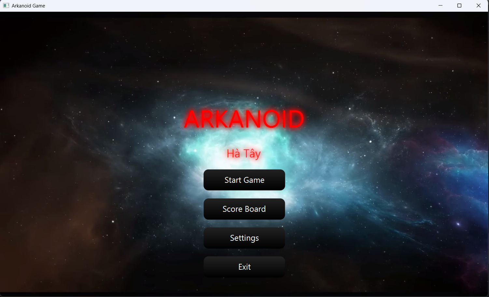
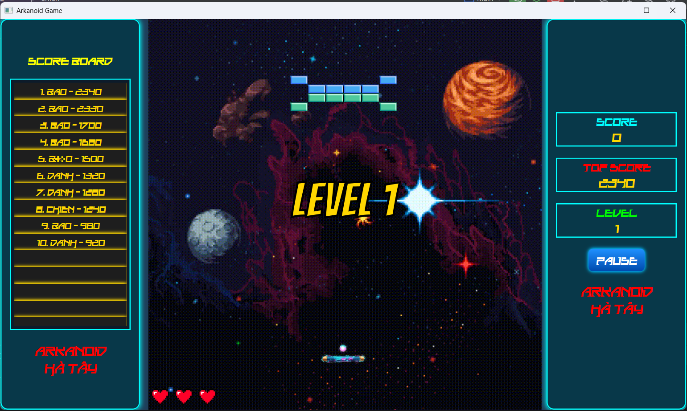
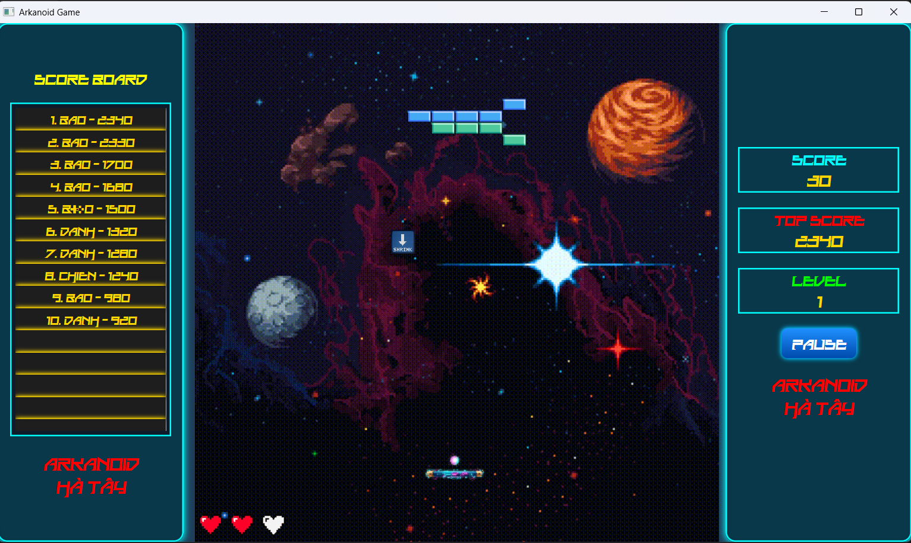
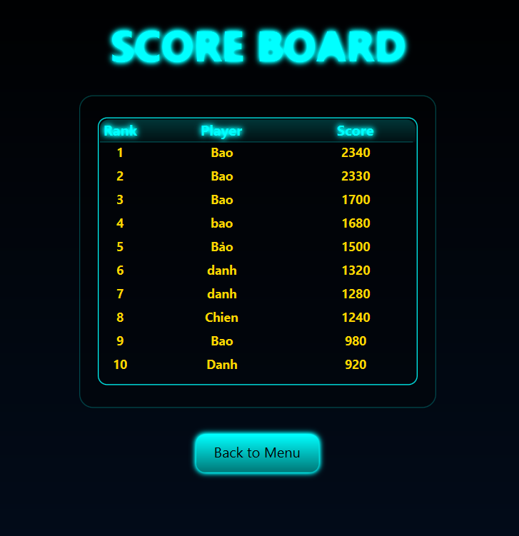

# 🎮 Arkanoid Game  
**Object-Oriented Programming Project**

**Tác giả:** Tam ca Hà Tây  
**Nhóm 1 — Lớp OOP INT2204 11 — I2526**

---

## 👥 Thành viên & Thông tin học phần
- Nguyễn Công Danh — 24021402  
- Nguyễn Văn Bảo — 24021386  
- Nguyễn Văn Chiến — 24021394  

**Giảng viên hướng dẫn:** Trần Hoàng Việt, Kiều Văn Tuyên  
**Học kỳ:** HK1 / 2025–2026

---

## 🎯 Giới thiệu
Đây là trò chơi **Arkanoid** phát triển bằng **Java** cho đồ án cuối kỳ môn **Lập trình Hướng đối tượng**. Dự án thể hiện:
- Áp dụng đầy đủ nguyên lý OOP (Encapsulation, Inheritance, Polymorphism, Abstraction)
- Vận dụng các **design patterns** (Singleton, Factory Method)
- Giao diện trực quan, âm thanh/sprite sống động
- Hỗ trợ **save/load** và **leaderboard**

---

## ✨ Tính năng chính
- Viết bằng **Java 24+**, GUI **JavaFX** (có module tách bạch, dễ thay thế bằng Swing nếu cần)
- **Power-up** đa dạng, hiệu ứng âm thanh/animation
- **Nhiều màn chơi** với độ khó tăng dần
- **Multithreading** cho cập nhật vật lý & render mượt
- **Cấu trúc module hóa**, dễ mở rộng (màn chơi, brick, vũ khí, AI…)
- **Bảng xếp hạng**

---

## UML Diagram
- **Class Diagram**

---

## 🖼️ Ảnh & Video Demo

| Menu chính | Gameplay | Power-ups | Leaderboard |
|---|---|---|---|
|  |  |  |  |

**Video:** xem *full gameplay* tại `docs/demo/gameplay.mp4` *(hoặc thay bằng link YouTube/Git LFS/Releases)*

---

## 🧰 Công nghệ sử dụng
| Công nghệ | Phiên bản | Mục đích |
|---|---:|---|
| Java | 24+ | Ngôn ngữ chính |
| JavaFX | 21 | GUI |
| Maven | 3.9.9 | Build tool |

---

## ⚙️ Cài đặt & Chạy thử

> **Yêu cầu:** JDK 17+, Maven 3.9+, JavaFX 19.0.2+  
> Trên Windows/macOS, khuyến nghị dùng **JavaFX SDK** kèm biến môi trường `PATH_TO_FX` (nếu không dùng plugin maven-javafx).

## 🕹️ Cách chơi & Điều khiển

### Điều khiển
| Phím / Chuột | Hành động |
|---|---|
| ← | Di chuyển thanh trượt sang trái |
| → | Di chuyển thanh trượt sang phải |
| `SPACE` | Thả bóng / Bắn laser |
| Chuột | Ngắm/điều khiển hướng bóng |

### Cách chơi
1. Từ **Menu chính**, chọn **Start Game**.  
2. Dùng phím mũi tên để di chuyển **thanh trượt**.  
3. **Thả bóng** bằng `SPACE` hoặc dùng chuột điều hướng bóng để bắt đầu.  
4. **Bật nảy** bóng phá **gạch** để ghi điểm và qua màn.  
5. **Bắt power-up** rơi xuống để nhận hiệu ứng có lợi.  
6. **Giữ bóng** không rơi khỏi đáy màn hình (mất một mạng nếu rơi).  
7. Phá **toàn bộ gạch có thể phá** để hoàn thành màn và sang mức độ khó cao hơn.

---

## 🔮 Power-ups
| Icon | Tên | Hiệu ứng |
|---|---|---|
| 🟦 | Expand Paddle | Tăng độ rộng thanh trượt trong **10s** |
| 🟥 | Shrink Paddle | Giảm độ rộng thanh trượt trong **10s** |
| 🎯 | Multi Ball | Tạo thêm **2** bóng phụ |
| 🔥 | Fire Ball | Bóng **xuyên gạch** trong **5s** |

---

## 🧮 Hệ thống điểm
- **Mỗi lần brick vỡ sẽ +10 điểm, khi người chơi hết mạng thì điểm sẽ cập nhật lên Score Board**.

---

## Giấy phép
- **This project is developed for educational purposes only.**

- **Academic Integrity: This code is provided as a reference. Please follow your institution's academic integrity policies.**

---

## Notes
- **The game was developed as part of the Object-Oriented Programming with Java course curriculum.**
- **All code is written by group members with guidance from the instructor.**
- **Some assets (images, sounds) may be used for educational purposes under fair use.**
- **The project demonstrates practical application of OOP concepts and design patterns.**

---

Last updated: 12/11/2025

